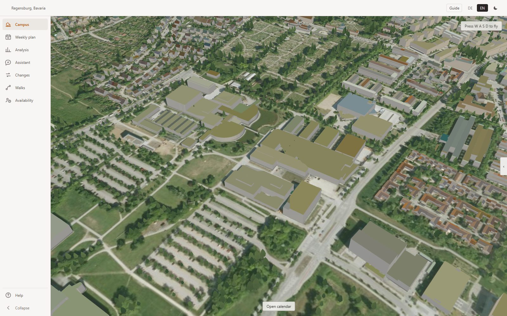
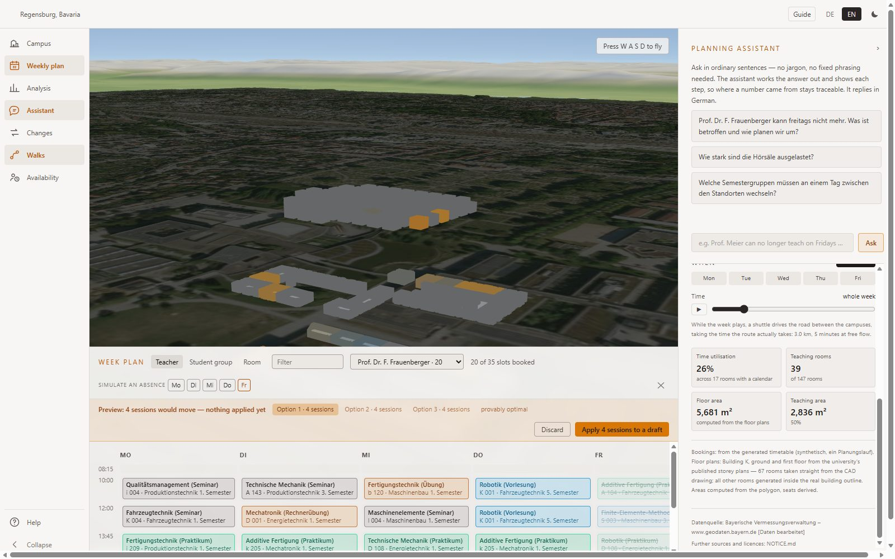
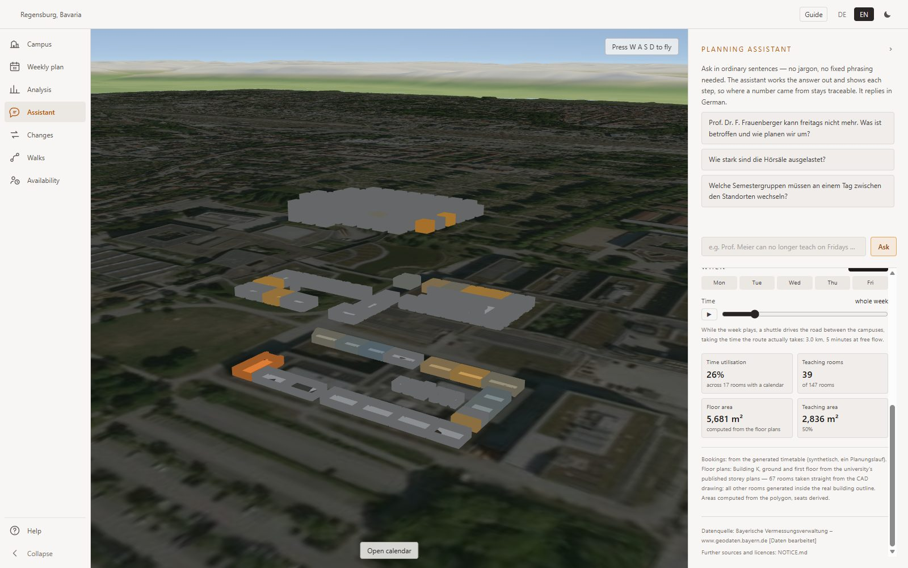
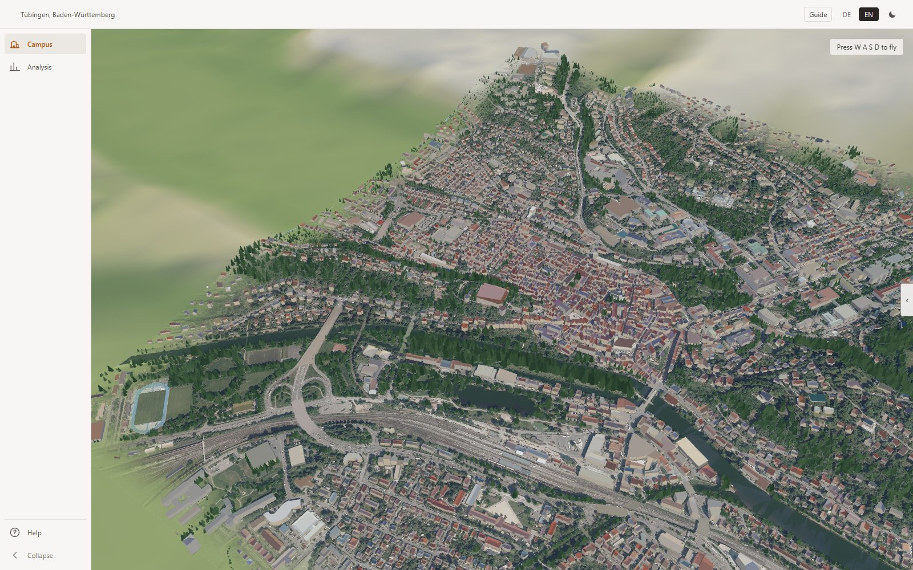

# Campus Scheduler

**A timetable that repairs itself, on a twin of the real campus.**



*A campus in Regensburg, Bavaria. 1 m state terrain under a 20 cm orthophoto, LoD2 buildings with
roof colour measured from the aerial photograph, and the city's own tree cadastre — no map service,
no tile server, no API key.*

---

## Read this first: where the data comes from

**Everything in this template is open, public data or is generated by this repository. There is no
customer data in it, and there is no private data in it.**

| What you see | Where it comes from |
|---|---|
| Terrain, orthophoto, buildings, trees | **Official state survey open data** — LDBV Bavaria (CC BY 4.0), LGL Baden-Württemberg (dl-de/by-2-0), Geobasis NRW (dl-de/zero-2-0), Copernicus DEM |
| Land cover, footpaths, indoor room outlines | **OpenStreetMap**, ODbL |
| Room numbers and floor plans | The universities' **own published** site and floor plans |
| **The timetable** | **Generated by this repository** — see `tools/data/generate_timetable.py` |
| Seats, attendance, building condition, costs | **Invented**, and badged as synthetic wherever they appear |

Every source and its required attribution is in [NOTICE.md](NOTICE.md). Nothing here needs a map
service, a tile server or an API key, at build time or at run time.

**No university supplied anything, reviewed anything or endorsed anything.** The buildings and the
room numbers are real because they are published; the teaching week inside them is ours. That
combination is the one genuinely risky thing this app does — a real, checkable room number next to
an invented utilisation figure reads as the university's own number — so provenance is part of the
data model rather than a disclaimer, and the app refuses to make claims it cannot support. See
[What is real and what is not](#what-is-real-and-what-is-not).

## Read this second: why these eight universities

**The selection is close to arbitrary, and it is not a ranking, a recommendation or a customer
list.** They are simply places where the two things this app needs both exist:

1. the state publishes LoD2 buildings, a 1 m terrain model and a 20 cm orthophoto as open data, and
2. there is a campus worth flying a camera around.

Beyond that the choice was "several of the larger German universities, across four different state
survey authorities" — because a twin that works in exactly one state is not a template, it is a
one-off. Aachen, Cologne and Münster are in this list mainly to prove the North Rhine-Westphalia
adapter works, and Tübingen is here because Baden-Württemberg publishes its data through an entirely
different portal from Bavaria's.

Swap any of them out. A site is one JSON file in `config/aoi/` and one pipeline run.

> Demonstration and training only. Not a planning system of record, and not a statement about any
> real institution's rooms, staff, utilisation or building condition.

---

## What this is

A **Microsoft Fabric App** for the person who has to move a lecture.

A professor says they cannot teach on Friday. Four courses have to move; each one needs a free
room of the right kind, a slot where the students are not already somewhere else, and — because
this university has two campuses 2.5 km apart — enough time to get across town in the break. Doing
that by hand in a spreadsheet is a day's work, and the plan that comes out is not obviously any
good.

Here it is a sentence typed into a chat. An [OR-Tools CP-SAT][cpsat] solver returns the *smallest*
set of moves that resolves it, with a proof of optimality, and the calendar shows what would change
before anything is saved.



*One lecturer's Friday is blocked. Four sessions have to move; the solver returns three options,
each of four moves, each **provably optimal** — and nothing is applied until somebody says so. The
struck-through entries are what would leave; the plan of record has not changed.*

The subject is timetabling. **The point is Fabric** — the app itself as the delivery vehicle, a
Fabric SQL database behind the write-back, and an Azure AI Foundry agent that calls the solver as
a tool rather than pretending to be one. A language model never places a session. It decides what
the planner *meant*; only the solver decides whether a plan is legal.

## The campus is not a picture of a campus

The 3D view is built from official state survey data and nothing else — **no map service, no tile
server, no API key, at build time or at run time.**

- 1 m terrain from the state survey, resampled to a 2 m grid, at true scale with no vertical
  exaggeration
- a 20 cm orthophoto draped over it
- LoD2 buildings with **measured roof colour** — the median of the aerial-photo pixels inside each
  building's own roof outline, 98–99 % coverage
- individual trees from the state tree cadastre, or detected from a normalised surface model where
  no cadastre exists
- a Copernicus DEM shell out to ~20 km, so the horizon is a landscape rather than a cliff edge

That is what makes the travel-time constraint honest rather than decorative: the distance the
solver refuses to schedule across is the distance you can see.

Buildings open. Click one and it explodes into its floors, drawn from published architectural floor
plans where the university has them and from surveyed OpenStreetMap indoor mapping where it does
not — real rooms, with their real numbers, coloured by how much of the week they are used.



*Building K, opened. The ground and first floors are traced from the university's **published**
storey plans — 67 rooms straight off the CAD drawing — and the rest are generated inside the real
building outline. The panel says which is which, because the room numbers are real and the
utilisation is not.*

## Eight universities, one build

The site is configuration. Adding one is a JSON file and a pipeline run, and the eight below were
chosen for the reasons in [Read this second](#read-this-second-why-these-eight-universities)
rather than for anything about the universities themselves.

| AOI | University | Planner | Survey |
|---|---|---|---|
| `oth-regensburg` | OTH Regensburg — two campuses, 2.5 km apart | yes | LDBV Bavaria |
| `lmu-muenchen` | LMU Munich — main campus + Innenstadt teaching hospital | yes | LDBV Bavaria |
| `garching` | TU Munich, Garching research campus | — | LDBV Bavaria |
| `tuebingen` | University of Tübingen — Old Town, Neckar, castle | — | LGL Baden-Württemberg |
| `fau-erlangen` | FAU Erlangen-Nürnberg | — | LDBV Bavaria |
| `aachen` | RWTH Aachen University | — | Geobasis NRW |
| `koeln` | University of Cologne | — | Geobasis NRW |
| `muenster` | University of Münster | — | Geobasis NRW |

Open one with `?aoi=<id>`, or from the map of Germany on the landing screen. The six sites without
a planner are campus twins: they have a scene and no week to replan, and the app says so rather
than offering a calendar that would open onto nothing.



*Tübingen — 6 417 LoD2 buildings and 11 406 trees over 127 m of real relief, from a different state
survey (LGL Baden-Württemberg) reached through an entirely different portal. Same pipeline, same
code, one JSON file. That is the difference between a template and a one-off.*

## Getting started

```bash
npm install
npm run data:build -- --aoi oth-regensburg    # ~10 min, downloads ≈1 GB of survey tiles
npx vite                                       # http://localhost:5173
```

⚠️ **`npx vite`, not `npm run dev`.** The npm scripts have Rayfin pre-hooks that need Fabric auth;
`npx vite` and `npx vite build` run without it.

⚠️ **`public/terrain/` is not in the repository.** It is 20–40 MB of generated terrain, drape,
building and vegetation assets per site, rebuilt by the pipeline from the open sources listed in
[NOTICE.md](NOTICE.md). Until it is built, the app renders a setup notice explaining what to run —
not a blank canvas.

The geodata pipeline needs Python 3.11+ and exactly three third-party packages:

```bash
pip install -r tools/requirements.txt          # numpy, pillow, scipy
python tools/geodata/pipeline.py --aoi oth-regensburg --list   # what runs, and what is skipped
```

The planner backend (FastAPI + CP-SAT + the Foundry agent loop) is a separate container:

```bash
pip install -r server/requirements.txt
python tools/data/generate_timetable.py --site oth
python tools/data/validate_dataset.py --site oth     # an independent gate; exits non-zero
SCHEDULER_SITE=oth uvicorn app:app --app-dir server --port 8080
```

**The app runs without it.** With no backend configured the twin, the lenses and the deep links all
work, and the planner surfaces are simply not offered.

Deploy to Fabric with `npx rayfin up`, then verify the *running* system —
`node tools/verify_deploy.mjs --url <hosting URL>` — because the frontend and the backend deploy
separately and diverge silently.

## Project structure

| Path | What lives there |
|---|---|
| `src/twin3d/` | The 3D engine: terrain, drape, LoD2 buildings, vegetation, rooms, walk routes, the flying camera. Three.js, no scene-graph framework |
| `src/lenses/` | Room occupancy, teaching load, plan quality, building condition — a registry, so a site only offers a lens whose data it has |
| `src/planner/` | Calendar model, conflict shapes, walk-route transfer logic |
| `src/components/` | The cockpit: nav rail, week grid, chat, change list, guided tour |
| `src/config/` | AOI registry, the public-release switch, deep-link parsing |
| `src/i18n/` | German and English catalogues. Parity is a **contract**, and it is tested |
| `server/` | FastAPI backend: the CP-SAT solver, the agent tools, the Foundry loop |
| `tools/geodata/` | The 13-step pipeline that turns survey downloads into browser assets |
| `tools/data/` | Timetable generation, room geometry, walking routes, the dataset validator |
| `tools/tests/` | Python suites. ⚠️ **scripts, not pytest** — run each file directly |
| `config/aoi/` | One JSON per site: bounding boxes, control points, lenses, attribution |
| `config/academic/` | The invented half of a university: programmes, block scheme, room policy |
| `rayfin/` | Fabric service configuration and the write-back data schema |
| `e2e/` | Playwright. Asserts pixels and scene state, not that a button has a class |

## Scripts

| Script | What it does |
|---|---|
| `npm run dev` | Vite dev server (Rayfin pre-hook; use `npx vite` to skip it) |
| `npm run build` | `tsc -b` then `vite build` |
| `npm run preview` | Serve the built bundle |
| `npm run lint` | ESLint 9 flat config |
| `npm test` | Vitest unit suite |
| `npm run e2e` | Playwright, `fast` project |
| `npm run e2e:full` | Playwright, everything. ⚠️ `workers: 1` is deliberate — two large WebGL scenes at once make the suite lie |
| `npm run data:build` | The geodata pipeline for one AOI |
| `npm run data:probe` | Survey a candidate site before committing an AOI to it |
| `npm run check:release` | Is the publication switch set correctly, and does the disk agree? |
| `npm run check:publishable` | Read every file git would carry, as bytes, and refuse anything unreviewed |
| `npm run test:release-switch` | Run the unit suite in all six release postures |

## What is real and what is not

This app draws real buildings, at true scale, with their real room numbers on them, so every figure
it shows is read as the university's own. Provenance is therefore part of the data model rather
than a disclaimer:

| Measured | Derived | Invented (badged as synthetic) |
|---|---|---|
| terrain, orthophoto, buildings, trees | room area, from real polygons | seats per room, attendance |
| room polygons, usage types, floor assignment | storey count, gross floor area | the teaching week itself |
| campus footprints, walking-path network | travel times, from the real path graph | building condition grades, refurbishment cost |

A room with no calendar is **grey, never 0 %** — "unknown" and "empty" are different answers, and
the whole product depends on the difference staying visible.

See [NOTICE.md](NOTICE.md) for sources and licences, and [AGENTS.md](AGENTS.md) before changing
anything that produces a number.

[cpsat]: https://developers.google.com/optimization/cp/cp_solver
