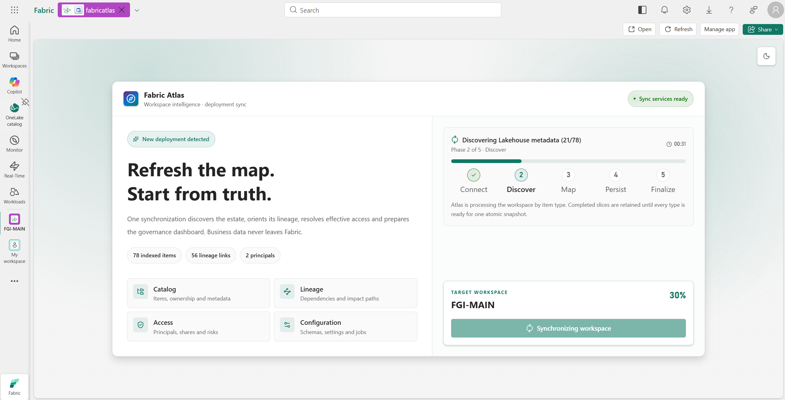
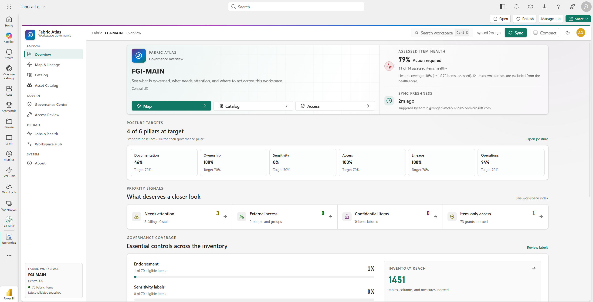
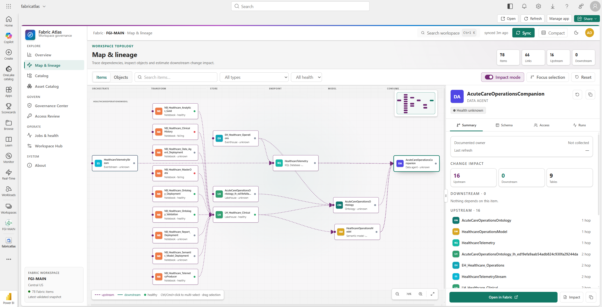
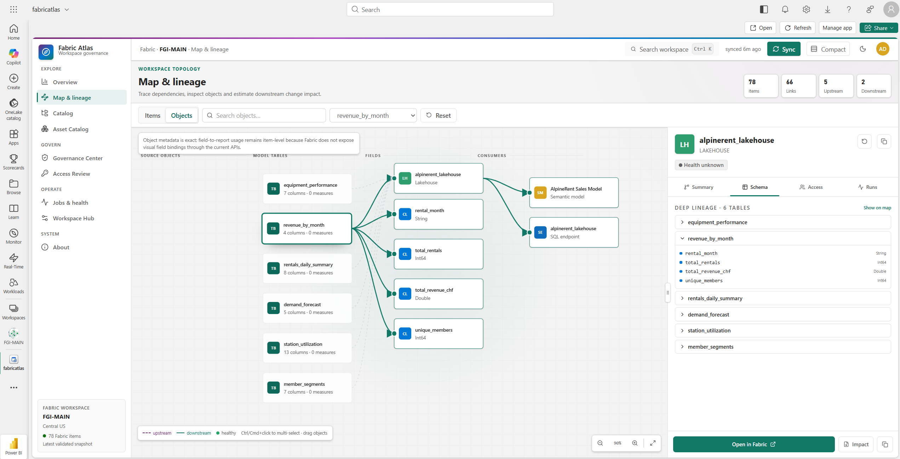
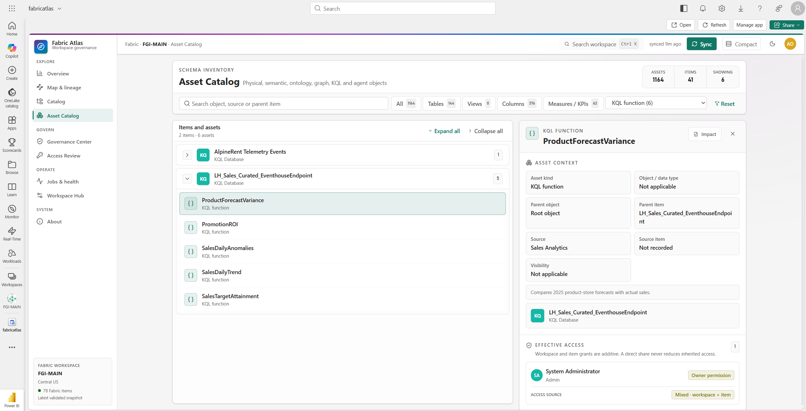
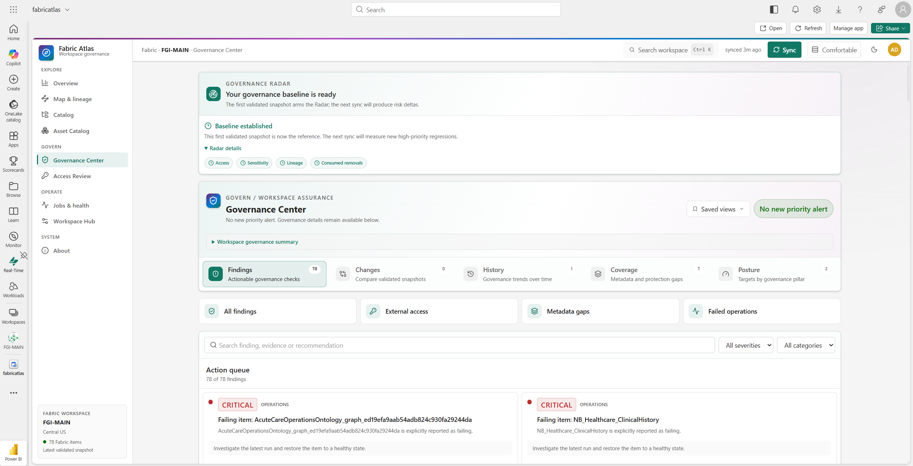
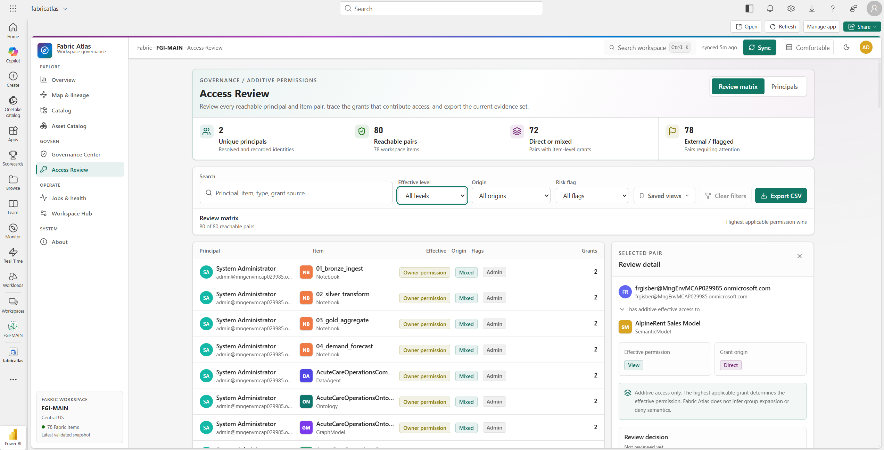
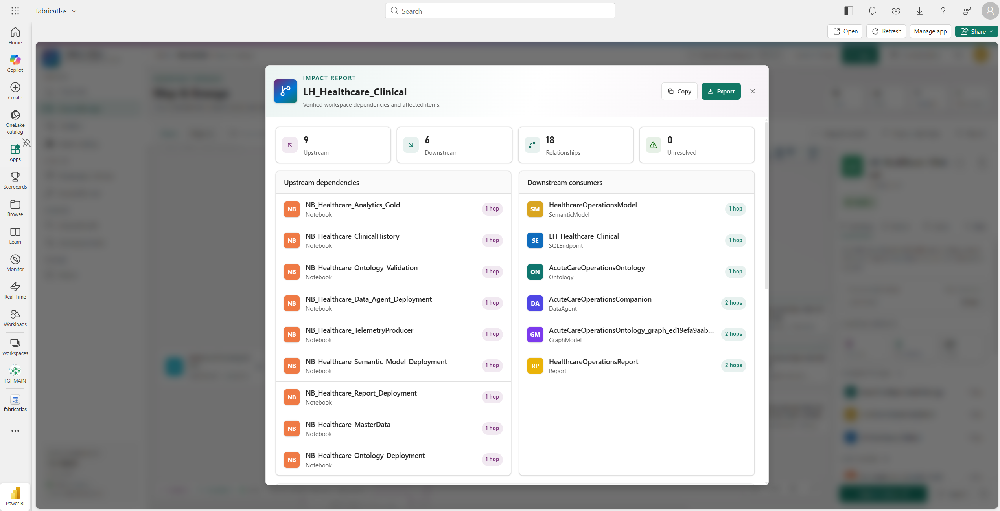
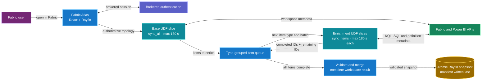

<div align="center">


Fabric Atlas gives a team one readable map of its Fabric workspace. It brings
together lineage, item metadata, access, sensitivity and run history, then keeps
the last validated snapshot in Fabric so everyone sees the same state.

[](https://github.com/fredgis/FabricAtlas/releases/latest)
[](LICENSE)
[](https://react.dev/)
[](https://github.com/microsoft/rayfin)
[](https://www.microsoft.com/microsoft-fabric)

[Install](docs/installation.md) ·
[Architecture](docs/architecture.md) ·
[Functionalities](#functionalities) ·
[Roadmap](#roadmap) ·
[Changelog](CHANGELOG.md) ·
[Upstream project](https://github.com/fredgis/FabricAtlas)

</div>

## Quick look

https://github.com/user-attachments/assets/9b7162a0-fefc-432b-8c01-e90dacb8f1db

[Watch the Full HD version on YouTube](https://youtu.be/cgkhUFTEPeI)

## What it does

Fabric workspaces spread operational metadata across many portal pages and APIs.
Fabric Atlas collects that metadata without copying business data.

- Browse workspace items as cards or a sortable table, then inspect their internal objects.
- Inspect Lakehouse, Warehouse, SQL Database and KQL tables, views, columns,
  functions and materialized views when the required metadata access is available.
- Explore Ontology entities, properties, relationships and bindings, Graph Model
  node and edge types, and Data Agent source selections.
- Trace item and verified object lineage from physical sources through models,
  ontologies, graphs, agents and reports.
- Review effective access, direct shares and external principals.
- Check sensitivity coverage and confidential assets.
- Compare validated snapshots and review governance findings.
- Focus on newly introduced risks with Governance Radar and personal acknowledgements.
- Track six posture pillars against explicit governance targets.
- Generate departure packs with ownership, blast radius and reassignment evidence.
- Trace resolved DAX dependencies between measures and synchronized schema objects.
- Search the whole workspace with `Ctrl+K` and save useful filter views.
- Export access reviews and verified lineage impact reports.
- Inspect jobs, configuration and team notes in one workspace hub.
- Refresh the catalog through a guided synchronization flow.

## Functionalities

<details>
<summary><strong>Workspace synchronization and reliability</strong></summary>

| Functionality | What it provides |
|---|---|
| Guided first synchronization | A dedicated deployment screen with staged progress before the first catalog becomes visible |
| Header synchronization | Reuses the same progress model and atomically refreshes every view against the new snapshot |
| Progress donut | Replaces the initial topology illustration with an accessible percentage and stage-driven donut |
| Immutable snapshots | Writes catalog rows first and publishes the workspace manifest only after every write succeeds |
| Last-known-good fallback | Ignores incomplete snapshots and loads the newest valid workspace state |
| Trusted snapshot retention | Keeps 2–50 validated snapshots, supports explicit writer rotation and removes stale rows only after a new manifest is published |
| Lightweight history | Stores versioned trend summaries in manifests and loads detailed comparisons only when selected |
| Versioned sync contract | Records required, optional and metadata-capability status for every synchronized snapshot |
| Bounded UDF execution | Uses a 180-second deadline below Fabric's 200-second function limit, bounded retries and transport-size safety without truncating object-lineage relations by count |
| Resumable deep discovery | Runs one authoritative base scan, then processes item metadata in type-grouped UDF slices that automatically continue, split or isolate a slow item |
| Accessible sync feedback | Shows five real phases, the active stage and elapsed time during both initial synchronization and later refreshes |
| Deployment gate | Requires synchronization for the first deployment or a new major/minor snapshot contract, while compatible patch releases reuse validated history |
| Trusted synchronizer | Restricts snapshot publication to the configured synchronization account |
| Snapshot history | Loads previous validated snapshots for comparisons and governance trends |

</details>

<details>
<summary><strong>Governance Center</strong></summary>

| Functionality | What it provides |
|---|---|
| Findings | Actionable access, metadata, operations and lineage checks based on synchronized evidence |
| Governance Radar | Establishes a visible first-snapshot baseline, shows new priority risks, and keeps the no-new-risk state compact with a link to the exact latest comparison |
| Personal Radar state | Acknowledges one occurrence or mutes a stable finding for the signed-in user |
| Change Center | Compares any two validated snapshots across items, schema, access, sensitivity, lineage and jobs |
| Full change evidence | Shows complete before/after values and DAX expressions, with impact computed from the selected historical snapshot, including removed objects |
| Shareable comparisons | Preserves both selected snapshots, section and filters in the URL |
| Governance history | Tracks items, labels, external principals, failures, lineage and schema inventory over time |
| Lazy Change Center evidence | Keeps the ledger immediate and hydrates older detailed catalogs only for the selected comparison |
| Metadata coverage | Separates collected gaps from metadata that Fabric did not expose, using explicit `N/A` states |
| Posture targets | Scores six reproducible pillars against shared, configurable workspace targets, all set to 70% by default |
| Governance exceptions | Records an administrator's justification and expiry beside a finding without hiding the finding or changing its raw score |
| Sensitivity posture | Groups protected and unlabeled items and surfaces confidential assets |
| Saved governance views | Persists personal filters such as metadata gaps, external access or failed operations |

</details>

<details>
<summary><strong>Catalog and object inventory</strong></summary>

| Functionality | What it provides |
|---|---|
| Workspace catalog | Groups Fabric items by type with search, health, ownership, labels, tags and detail drawers |
| Catalog table | Keeps cards available and adds sorting by name, health, documented owner or last refresh within collapsed item-type groups |
| Asset Catalog | Lists relational, KQL, ontology, graph and Data Agent objects under their parent Fabric item, while keeping synchronized schema-capable items visible when no objects are exposed |
| Deep metadata | Shows data types, descriptions, visibility, sources, row counts, measure expressions and collection provenance when available |
| DAX dependency evidence | Resolves measure references only to real synchronized columns or measures and labels inferred source hops |
| KQL inventory | Discovers databases, tables, columns, stored functions and materialized views through read-only Kusto metadata |
| SQL Database inventory | Discovers schemas, tables, views and columns through read-only system catalogs |
| Ontology inventory | Decodes entity types, properties, time-series properties, source bindings, relationship types and contextualizations |
| Graph Model inventory | Shows node and edge types plus source and property mappings without reading graph instances |
| Data Agent inventory | Shows draft/published sources and selected tables, columns, measures, KQL objects, ontology entities and graph types without retaining prompts |
| Item context | Keeps properties, lineage, access, configuration and job history beside the selected item |
| Collapsed groups | Starts inventory lists grouped and collapsed for faster scanning |
| Ownership labels | Distinguishes documented item ownership from an Owner permission in the access evidence |

</details>

<details>
<summary><strong>Lineage and impact</strong></summary>

| Functionality | What it provides |
|---|---|
| Item lineage | Places Fabric items in lifecycle stages from orchestration to consumption |
| Object mode | Expands relational, KQL, semantic, ontology, graph and Data Agent objects using verified snapshot relationships |
| Impact tracing | Highlights upstream and downstream paths without moving the selected node |
| Indexed graph engine | Reuses adjacency indexes for traversal, impact, connected groups and staged layout |
| Accessible relationships | Exposes item and object edges as text and distinguishes upstream paths with a dashed pattern |
| Multi-selection | Moves several selected item or object nodes together |
| Layout controls | Provides zoom, fit, reset, filters, minimap and persistent deep links |
| Readable map and inspector | Wraps node labels, keeps inactive context readable and supports pointer or keyboard resizing of the details inspector |
| Impact reports | Exports verified dependency evidence as Markdown for an item or schema object |
| Object-level impact | Switches to DAX-resolved object granularity when evidence exists and preserves item fallback otherwise |
| Ontology and graph lineage | Connects physical objects to ontology properties and entities, then follows verified entity relationships and graph mappings |
| Data Agent lineage | Connects selected source objects to their Data Agent source and element nodes for downstream impact analysis |

</details>

<details>
<summary><strong>Access and information protection</strong></summary>

| Functionality | What it provides |
|---|---|
| Additive effective access | Combines workspace and item grants so a direct share never reduces inherited access |
| Stable principal identity | Uses Fabric principal IDs and safely correlates legacy name or email references across snapshots |
| Access Review matrix | Reviews every reachable principal and item pair with permission, source and evidence |
| Responsive access ledger | Uses one keyboard-navigable representation across mobile and desktop without hidden duplicate rows |
| Principal review | Groups all reachable items under collapsible principal sections |
| Review decisions | Appends personal Reviewed, Accepted, Needs action and clear events with retained notes and history |
| Evidence revalidation | Marks a decision Needs review when its permission evidence changes, including changed underlying grants that leave the strongest permission unchanged |
| CSV export | Downloads the currently filtered access evidence |
| Risk filters | Isolates external, broad, service-principal, admin and unresolved access |
| Departure packs | Finds sole ownership, urgent orphan risk, downstream blast radius and deterministic reassignment candidates |
| Offboarding exports | Downloads reassignment CSV, effective-access CSV and a complete Markdown handover pack |

</details>

<details>
<summary><strong>Operations and collaboration</strong></summary>

| Functionality | What it provides |
|---|---|
| Jobs and health | Groups refresh, pipeline and notebook activity with status, duration and errors |
| Health and coverage | Calculates observed health from assessed items and separately shows how much of the workspace has a known health status |
| Responsive job timeline | Shows compact mobile cards and an aligned desktop grid without horizontal table scrolling |
| Job filters | Searches run history, isolates failures and saves recurring operational views |
| Active filter chips | Removes search, status, focused item or focused run constraints independently |
| Workspace Hub | Keeps synchronized configuration and shared team notes in one grouped interface |
| Item notes | Adds append-only team context to the workspace or a specific Fabric item |
| Sync audit | Records who synchronized the workspace, when it ran and how much metadata was indexed |

</details>

<details>
<summary><strong>Search, navigation and personalization</strong></summary>

| Functionality | What it provides |
|---|---|
| Global `Ctrl+K` search | Searches items, relational/KQL objects, ontology and graph types, Data Agent selections, principals, jobs, configuration and notes |
| Debounced workspace index | Reuses one index per snapshot and never activates results from an earlier query |
| Targeted navigation | Opens the matching drawer, asset, review, job or Workspace Hub section |
| Shareable view state | Keeps active sections, filters, searches, selected assets and focused runs in namespaced URL parameters |
| Personal saved views | Stores user-scoped filter presets in the Fabric-backed Rayfin database |
| Display density | Switches between comfortable and compact spacing without reducing the text size |
| Browser-local display preferences | Remembers density, catalog layout and inspector width separately for each signed-in user and workspace on this browser |
| Light and dark themes | Uses a Fabric-aligned light mode by default with an optional persistent dark mode |
| Responsive navigation | Keeps grouped Explore, Govern, Operate and System sections usable on smaller screens |
| Keyboard-first controls | Adds managed dialogs, focus restoration, skip navigation and Arrow/Home/End tab navigation |
| Large-list containment | Lets Chromium skip off-screen rendering work for dense Access, Asset Catalog and Jobs blocks |

</details>

<details>
<summary><strong>Security, deployment and open source</strong></summary>

| Functionality | What it provides |
|---|---|
| Fabric brokered authentication | Runs inside the Fabric portal with the signed-in Entra identity |
| Bound token selection | Matches every Fabric, Kusto and SQL token account and tenant to the current signed-in Fabric user |
| Metadata-only storage | Allowlists governance metadata and excludes rows, datasource details, connections and Power Query or source expressions |
| Definition sanitization | Excludes Data Agent instructions and few-shots, graph filter values, ontology documents/resource links, KQL function bodies and SQL module definitions |
| Scoped enrichment | Keeps advanced KQL, SQL and definition scans optional and reports missing token, permission or encrypted-label capability explicitly |
| User-scoped preferences | Protects saved views and access-review decisions with Rayfin row policies |
| User-scoped Radar actions | Protects acknowledgements and mutes through the authenticated subject claim |
| Fabric deployment | Builds, migrates the schema and deploys the app through `npx rayfin up` |
| Open-source project | Includes MIT licensing, contribution guidance, security reporting and release history |

</details>

## Product screenshots

### Guided deployment sync

The first deployment or a new major/minor snapshot contract starts with a
controlled metadata refresh. A five-phase tracker, active stage, elapsed time
and target workspace stay visible throughout the scan. The same tracker appears
during later refreshes, while compatible patch releases reuse the validated
catalog. Deep discovery advances with the real completed-item count. A slow
type is continued in a new UDF slice, and an individual slow item is retried in
isolation. Repeated no-progress attempts stop with an explicit item-level error
instead of looping forever. The browser warns before leaving while this
resumable queue is active.



### Workspace overview

The overview brings health, freshness, governance signals and inventory reach
together in a Fabric-native operational landing page.



### Interactive lineage

The map follows Fabric assets from orchestration to consumption. Selecting an
item highlights its verified path while the inspector keeps schema, access,
runs and impact actions beside the graph.



### Object lineage

Object mode expands a synchronized table into its columns and connected Fabric
items. The inspector keeps ownership, impact and related metadata visible while
objects are selected or rearranged. Selecting an object from another Fabric item
switches the active item and rebuilds the object graph. Deep-lineage tables can
be expanded or collapsed together. Connected Fabric items are grouped into
collapsible summary nodes, while Impact mode preserves the graph layout and only
changes the highlighted dependency paths. Hold the left mouse button on the
canvas background and drag to pan the complete graph.



### Asset Catalog

Tables, views, columns and measures are grouped by Fabric item. Selecting an
asset exposes its source, model context and additive effective access.



### Governance Center

Governance Radar, findings, snapshot changes, history, coverage and posture are
grouped into one governance workspace with saved views and evidence links.



### Access Review

The review matrix combines inherited and direct permissions, then supports
focused filtering, personal decisions and CSV export.



### Impact reports

An item or schema object can produce an exportable report with verified
upstream, downstream and relationship evidence.



## How it works



### Why the template includes a User Data Function

Fabric Atlas needs workspace metadata that a browser app cannot request
directly. The template therefore includes the source of a Fabric User Data
Function. The deployer publishes that function in the target workspace and
adds its invoke URL to `rayfin/.env`.

The function is a metadata collector, not another application database. It
uses delegated tokens from the signed-in synchronizer to call the required
Fabric, Power BI, Kusto and SQL metadata endpoints. It accepts only the token
audiences needed for each metadata source, rejects redirects and returns an
allowlisted response. It never reads business rows, notebook code, pipeline
definitions, connection secrets or Data Agent instructions.

Fabric limits one function call to 200 seconds. Atlas uses a 180-second budget,
collects the workspace topology first, then resumes deeper discovery in smaller
item batches. The app publishes a new Rayfin snapshot only after every required
section and item has completed. If the function fails or the user cancels the
sync, Atlas keeps the previous snapshot active.

See [Architecture](docs/architecture.md) for the full data flow.

## Roadmap

### v2 backlog

The following P2 and P3 work is planned for the v2 series. It is outside the
v1.11 release scope. The table describes intended behaviour, not features
available in the current app.

| Priority | Planned feature | Scope |
|---|---|---|
| P2 | Scheduled synchronization | Refresh metadata on the server without an open browser, using an identity supported by the required APIs and write policies |
| P2 | Shared action plan | Assign findings, set deadlines and track team resolution, including actions from departure packs |
| P2 | Teams and email notifications | Notify the team about relevant new findings and synchronization failures |
| P2 | Simultaneous departures | Assess several departing principals together so reassignment does not depend on another departing person |
| P2 | Entra group membership | Expand group evidence where permissions allow it, while distinguishing direct grants from membership-derived access |
| P2 | Multi-workspace catalog and verified lineage | Index an explicitly selected workspace scope and show cross-workspace relationships only when Microsoft exposes the evidence |
| P2 | Durable background synchronization | Persist continuation state server-side so a refresh can survive a closed browser and later support scheduled execution |
| P3 | Report visual field usage | Read supported report definitions to trace measure and column references to visuals, subject to report permissions and sensitivity restrictions |

### Multi-workspace milestones

Multi-workspace catalog support is planned and tracked in
[#4](https://github.com/fredgis/FabricAtlas/issues/4). The implementation will
stay focused on a controlled set of workspaces rather than scanning an entire
tenant automatically.

| <sub>Target</sub> | <sub>Planned PR</sub> | <sub>Release</sub> | <sub>Engineering scope</sub> | <sub>Exit criteria</sub> |
|---|---:|---|---|---|
| <sub>Q4 CY26</sub> | <sub>PR 1</sub> | <sub>v2.0.0</sub> | <sub>Keep catalog reads shared with the authorized app audience and restrict scope changes to the configured synchronizer. Refactor persistence around an explicit `workspaceId`, add independent manifests and migrate the existing single-workspace snapshot.</sub> | <sub>A failed or incomplete workspace refresh cannot invalidate another workspace snapshot.</sub> |
| <sub>Q4 CY26</sub> | <sub>PR 2</sub> | <sub>v2.0.0</sub> | <sub>Add UDF workspace discovery, persist the selected indexing scope, and run a bounded synchronization queue with progress and errors reported per workspace.</sub> | <sub>The synchronizer can select workspaces, refresh them independently and retry only failures.</sub> |
| <sub>Q4 CY26</sub> | <sub>PR 3</sub> | <sub>v2.0.0</sub> | <sub>Add available, selected and active workspace state with lazy snapshot loading. Aggregate Overview, Catalog, Asset Catalog, Access, Sensitivity and Jobs. Keep Workspace Hub, configuration and comments tied to one active workspace.</sub> | <sub>Multi-workspace catalog MVP ready for release.</sub> |
| <sub>Q1 CY27</sub> | <sub>PR 4</sub> | <sub>v2.0.1</sub> | <sub>Use composite graph IDs, open one workspace by default and allow comparison of up to three workspaces in separate visual groups. Show local lineage only at this stage.</sub> | <sub>Comparison stays readable and never creates an inferred connection.</sub> |
| <sub>Q1 CY27</sub> | <sub>PR 5</sub> | <sub>v2.0.2</sub> | <sub>Run grouped metadata scans for the selected workspaces, build a global item index and persist source and target workspace IDs on relationships returned by Microsoft.</sub> | <sub>Verified cross-workspace lineage appears only when both endpoints are part of the indexed scope.</sub> |

`v2.0.0` is the multi-workspace catalog milestone planned for Q4 CY26.
`v2.0.1` adds lineage comparison, followed by verified cross-workspace
relationships in `v2.0.2` during Q1 CY27. These dates are targets and may move
if Fabric API coverage changes.

## Getting started

### Local preview

Scaffold the template from the Awesome Rayfin gallery, then enter the generated
directory.

```powershell
npm create @microsoft/rayfin -- --template https://github.com/microsoft/awesome-rayfin
Set-Location <generated-directory>
$env:VITE_RAYFIN_ATLAS_DEMO_MODE = "true"
npm ci
npm run dev
```

The local app uses the included AlpineRent preview estate.

### Deploy to Fabric

```powershell
npx rayfin login --tenant <tenant-id> --select
$env:RAYFIN_PUBLIC_ATLAS_SYNC_ADMIN_EMAIL = "<authorized-sync-user>"
$env:RAYFIN_PUBLIC_ATLAS_SYNC_ADMIN_SUBJECT = "<authorized-sync-subject>"
npx rayfin up --workspace "<workspace-name>"
```

Publish the function in
[`fabric/udf/atlas_sync_functions/`](fabric/udf/atlas_sync_functions/), then add
the public deployment values to the git-ignored `rayfin/.env` file:

```powershell
Copy-Item .env.example rayfin/.env
```

```dotenv
RAYFIN_PUBLIC_ATLAS_SPA_CLIENT_ID=<entra-client-id>
RAYFIN_PUBLIC_ATLAS_UDF_URL=https://<host>/functions/sync_all/invoke
RAYFIN_PUBLIC_ATLAS_WORKSPACE_NAME=<workspace-display-name>
RAYFIN_PUBLIC_ATLAS_SYNC_ADMIN_EMAIL=<authorized-sync-user>
RAYFIN_PUBLIC_ATLAS_SYNC_ADMIN_SUBJECT=<authorized-sync-subject>
RAYFIN_PUBLIC_ATLAS_SNAPSHOT_RETENTION_COUNT=12
# Optional during synchronizer rotation:
RAYFIN_PUBLIC_ATLAS_PREVIOUS_SYNC_WRITERS=<former-user@example.com>
RAYFIN_PUBLIC_ATLAS_SENSITIVITY_RANKS='{"<label-id>":3,"<lower-label-id>":1}'
```

Keep the configured synchronizer available in the CLI process environment when
running `npx rayfin up`: its immutable Rayfin subject is needed to compile the
database policies, while the email remains the visible contact and historical
snapshot identifier. The app opens on a guided synchronization screen.

The complete Entra, UDF and deployment steps are in
[docs/installation.md](docs/installation.md).

## Project structure

```text
src/
  atlas/          Catalog, synchronization, persistence and product views
  components/     Authentication shell components
  hooks/          Authentication and theme hooks
  lib/            Rayfin client
  services/       Fabric brokered authentication
rayfin/
  data/           Persisted entities and row policies
fabric/
  udf/            Fabric metadata User Data Function source and tests
docs/             Architecture, data model and deployment guidance
scripts/          Local Fabric portal tooling
```

## Scripts

```powershell
npm test
npm run lint
npm run build
```

| Script | Purpose |
|---|---|
| `npm run dev` | Start the local preview |
| `npm run typecheck` | Run strict TypeScript checking |
| `npm test` | Run the Vitest suite |
| `npm run lint` | Run ESLint |
| `npm run build` | Build the production application |
| `npm run test:fabric` | Open the local app inside the Fabric portal |

`npm run typecheck` runs `tsc -b --force` with strict checking and `noEmit`.
The project does not enable TypeScript's `noCheck` option.

The current production build intentionally ships one main application chunk of
about 0.9 MB minified, or about 0.25 MB gzip. Vite also reports that the dynamic
Rayfin client import in `backend.ts` cannot form a separate chunk because
personal-state modules import the same client statically. This is accepted for
the current accelerator scale and should be revisited if the application or
startup cost grows materially.

| Path | Purpose |
|---|---|
| `src/atlas/views/` | Application pages |
| `src/atlas/store.tsx` | Hydration, synchronization and comments |
| `src/atlas/history.ts` | Validated snapshot comparison and governance trends |
| `src/atlas/governance.ts` | Effective access, findings and metadata coverage |
| `src/atlas/search.ts` | Global workspace search index |
| `src/atlas/lineage.ts` | Lineage normalization, traversal and layout |
| `src/atlas/backend.ts` | Workspace snapshots and Rayfin persistence |
| `src/atlas/live-sync.ts` | UDF invocation and response mapping |
| `rayfin/data/` | Persisted entity model |
| `fabric/udf/atlas_sync_functions/` | Server-side Fabric metadata scan |

## Access and collaboration scope

Fabric Atlas v1.x is scoped to one configured workspace and uses a shared
governance catalog. Every authenticated user who can open the deployed app can
read the complete synchronized metadata graph, including items, object
inventory, lineage, principals, access grants, jobs, configuration, snapshot
history and team notes. Catalog reads are not filtered per user. Control this
audience through the Fabric app and workspace access settings.

Saved views, access-review decisions and Governance Radar acknowledgements are
different: Rayfin policies bind those records to the authenticated subject, so
each user sees only their own personal state.

Access decisions are now append-only events. Older decisions remain in the
history but require a new review because they do not contain a permission
fingerprint. Clearing a decision appends an event rather than deleting history.

Governance targets and exceptions are shared workspace settings. Only the
configured synchronization administrator can change them. All six targets
default to 70%; the same current targets apply to Overview and historical
posture comparisons. Historical versions of the target policy are not stored.
An exception needs a reason and a future expiry. It annotates the finding
without hiding it or improving the underlying score, and it remains separate
from a user's personal mute.

Team notes are append-only in v1.x. Creation is bound to the authenticated
email and subject. Atlas stores the authenticated session email as the author
label, and that label remains stable after reload. Client-selected catalog
labels cannot impersonate another note author. Notes cannot currently be edited
or deleted.

Only the configured synchronization administrator can publish or prune
snapshots. When another user reaches the first-sync gate, Atlas displays the
configured account to contact.

## Security

Fabric Atlas stores workspace metadata and team notes. It does not persist
workspace business data. Tokens and deployment values stay outside Git in
`rayfin/.env`.

The synchronization boundary excludes scanner rows, datasource and connection
details, and Power Query or source expressions. Measure DAX is retained only as
explicit Semantic Model metadata.

The project has been reviewed against OWASP Top 10:2025 and ASVS 5.0. Security
hardening is part of the release process.

The shared authenticated read scope and append-only note behavior are described
above so deployments can set the app audience deliberately.

Report vulnerabilities through
[GitHub private vulnerability reporting](https://github.com/fredgis/FabricAtlas/security/advisories/new).

## Contributing

Found a bug, a missing Fabric object type or a useful governance workflow?
[Open an issue](https://github.com/fredgis/FabricAtlas/issues/new/choose).

Pull requests are welcome. Read
[the upstream contribution guide](https://github.com/fredgis/FabricAtlas/blob/main/.github/CONTRIBUTING.md)
before starting.

## Project links

- [Releases](https://github.com/fredgis/FabricAtlas/releases)
- [Changelog](CHANGELOG.md)
- [Installation](docs/installation.md)
- [Architecture](docs/architecture.md)
- [Data model](docs/data-model.md)
- [Metadata coverage audit](docs/fabric-metadata-coverage-audit.md)
- [Security policy](https://github.com/fredgis/FabricAtlas/blob/main/.github/SECURITY.md)
- [Code of conduct](https://github.com/fredgis/FabricAtlas/blob/main/.github/CODE_OF_CONDUCT.md)

## Scan coverage matrix

<sub>Atlas always indexes top-level items from the Fabric Items API. Deeper
inventory, lineage and item-level access depend on what the Fabric and Power BI
APIs expose for each type and on the required tenant settings. `N/A` means a
metadata capability was not collected; it is not treated as a missing value.</sub>

| <sub>Fabric element</sub> | <sub>Catalog and configuration</sub> | <sub>Internal inventory</sub> | <sub>Lineage</sub> | <sub>Access</sub> | <sub>Recent jobs</sub> | <sub>Known boundary</sub> |
|---|---|---|---|---|---|---|
| <sub>Workspace</sub> | <sub>Name, ID, capacity and region</sub> | <sub>Not applicable</sub> | <sub>Not applicable</sub> | <sub>Workspace role assignments</sub> | <sub>Not applicable</sub> | <sub>One workspace per `v1.x` deployment</sub> |
| <sub>Lakehouse</sub> | <sub>Description, OneLake paths, default schema and SQL endpoint status</sub> | <sub>Tables and columns from Lakehouse REST, scanner metadata or a downstream-model subset</sub> | <sub>Scanner relations and SQL endpoint path</sub> | <sub>Workspace roles and item users</sub> | <sub>When supported</sub> | <sub>Schema-enabled variants may require the downstream Semantic Model path</sub> |
| <sub>Warehouse</sub> | <sub>Description, collation, created and updated dates</sub> | <sub>Tables, views and columns from the scanner; downstream-model subset fallback</sub> | <sub>Scanner relations</sub> | <sub>Workspace roles and item users</sub> | <sub>When supported</sub> | <sub>Complete inventory can require SQL catalog connectivity</sub> |
| <sub>SQL Database</sub> | <sub>Database identity, endpoint, collation and backup metadata</sub> | <sub>Schemas, tables, views and columns from a constant read-only system-catalog query; scanner subset fallback</sub> | <sub>Scanner relations and verified downstream bindings</sub> | <sub>Workspace roles, item users and SQL metadata visibility</sub> | <sub>When supported</sub> | <sub>Requires an Azure SQL delegated token; no rows or module definitions are read</sub> |
| <sub>SQL endpoint</sub> | <sub>Item identity and scanner metadata</sub> | <sub>No dedicated internal-object scan</sub> | <sub>Storage-to-endpoint-to-model relations</sub> | <sub>Workspace roles and item users</sub> | <sub>When supported</sub> | <sub>Used primarily as a lineage bridge</sub> |
| <sub>Semantic Model</sub> | <sub>Description, storage mode, provider and documented `configuredBy` owner</sub> | <sub>Tables, columns, measures, descriptions, hidden flags, measure DAX and resolved object dependencies</sub> | <sub>Scanner item relations plus DAX-verified measure dependencies and explicitly inferred unique source hops</sub> | <sub>Workspace roles and item users</sub> | <sub>When supported</sub> | <sub>Requires scanner schema and expression options; unresolved/ambiguous references and source or Power Query expressions are discarded</sub> |
| <sub>Report</sub> | <sub>Report type, bound Semantic Model, documented `createdBy` owner and page inventory</sub> | <sub>Pages and order</sub> | <sub>Model binding plus scanner relations</sub> | <sub>Workspace roles and item users</sub> | <sub>When supported</sub> | <sub>Visuals and field bindings are not exposed by this flow</sub> |
| <sub>Dashboard</sub> | <sub>Item and scanner metadata</sub> | <sub>No deep object inventory</sub> | <sub>Scanner relations when returned</sub> | <sub>Workspace roles and item users</sub> | <sub>When supported</sub> | <sub>Tile and visual bindings are not expanded</sub> |
| <sub>Notebook</sub> | <sub>Item description and modified metadata when returned</sub> | <sub>Source code and cells are not read</sub> | <sub>Scanner relations</sub> | <sub>Workspace roles and item users</sub> | <sub>Up to 3 returned instances</sub> | <sub>No owner is inferred without a documented owner field</sub> |
| <sub>Data Pipeline</sub> | <sub>Item description and modified metadata when returned</sub> | <sub>Activities and expressions are not expanded</sub> | <sub>Scanner relations</sub> | <sub>Workspace roles and item users</sub> | <sub>Up to 3 returned instances</sub> | <sub>No owner is inferred and pipeline definitions are not copied</sub> |
| <sub>Dataflow</sub> | <sub>Item metadata and documented `configuredBy` owner</sub> | <sub>Entities and Power Query definitions are not expanded</sub> | <sub>Official upstream Dataflow/Datamart IDs plus scanner relations</sub> | <sub>Workspace roles and item users</sub> | <sub>When supported</sub> | <sub>Cross-workspace dependencies are omitted; query content is not copied</sub> |
| <sub>Datamart</sub> | <sub>Item metadata and documented `configuredBy` owner</sub> | <sub>No deep object inventory</sub> | <sub>Official upstream Dataflow/Datamart IDs plus scanner relations</sub> | <sub>Workspace roles and item users</sub> | <sub>When supported</sub> | <sub>Cross-workspace dependencies are omitted</sub> |
| <sub>Eventhouse</sub> | <sub>Item metadata and contained KQL Database IDs</sub> | <sub>Databases remain separate catalog items</sub> | <sub>Verified Eventhouse-to-database relations</sub> | <sub>Workspace roles and item users</sub> | <sub>When supported</sub> | <sub>Eventhouse hosts databases; tables belong to each KQL Database</sub> |
| <sub>KQL Database</sub> | <sub>Parent Eventhouse, query endpoint and database type</sub> | <sub>Tables, columns, functions and materialized views from read-only Kusto metadata</sub> | <sub>Parent, materialization and verified consumer relations</sub> | <sub>Workspace roles, item users and KQL database reader access</sub> | <sub>When supported</sub> | <sub>Requires a separate Kusto delegated token; function bodies and rows are excluded</sub> |
| <sub>KQL Queryset / Dashboard</sub> | <sub>Top-level item metadata</sub> | <sub>No saved query text or dashboard payload</sub> | <sub>Scanner or explicit source relations when returned</sub> | <sub>Workspace roles and item users</sub> | <sub>When supported</sub> | <sub>Query text and visual definitions remain outside the metadata boundary</sub> |
| <sub>Ontology</sub> | <sub>Item metadata and definition capability</sub> | <sub>Entity types, properties, time-series properties, bindings, relationship types and contextualizations</sub> | <sub>Physical source-to-property bindings and entity-relationship-entity paths</sub> | <sub>Workspace/item access; definition enrichment requires read-write item permission</sub> | <sub>Not applicable</sub> | <sub>Preview; encrypted labels can block definition retrieval; documents, resource links and instances are excluded</sub> |
| <sub>Graph Model</sub> | <sub>Item metadata and definition capability</sub> | <sub>Node types, edge types, properties and source mappings</sub> | <sub>Physical source-to-node/edge/property mappings</sub> | <sub>Workspace/item access; definition enrichment requires read-write item permission</sub> | <sub>Not applicable</sub> | <sub>Preview; filter literals and graph instances are excluded</sub> |
| <sub>Data Agent</sub> | <sub>Published state and description when exposed</sub> | <sub>Configured source items and selected tables, columns, measures, KQL objects, ontology entities and graph types</sub> | <sub>Selected source objects feed Data Agent source and element nodes</sub> | <sub>Workspace/item access; definition enrichment requires read-write item permission</sub> | <sub>Not applicable</sub> | <sub>AI instructions, data-source instructions, few-shot questions/queries and answers are excluded</sub> |
| <sub>Eventstream</sub> | <sub>Item and scanner metadata</sub> | <sub>Internal stream topology is not expanded</sub> | <sub>Scanner relations</sub> | <sub>Workspace roles and item users</sub> | <sub>When supported</sub> | <sub>Event payloads are never read</sub> |
| <sub>Mirrored Database</sub> | <sub>Item and scanner metadata</sub> | <sub>Mirrored tables are not expanded</sub> | <sub>Scanner relations</sub> | <sub>Workspace roles and item users</sub> | <sub>When supported</sub> | <sub>Source data and replication contents are not read</sub> |
| <sub>User Data Function</sub> | <sub>Item and scanner metadata</sub> | <sub>Function source and endpoints are not expanded</sub> | <sub>Scanner relations</sub> | <sub>Workspace roles and item users</sub> | <sub>When supported</sub> | <sub>Function code is not copied</sub> |
| <sub>Fabric App / AppBackend</sub> | <sub>Item identity from the Fabric Items API</sub> | <sub>No internal service inventory</sub> | <sub>Only when a Fabric API exposes a relation</sub> | <sub>Workspace roles</sub> | <sub>When supported</sub> | <sub>Not currently an admin-scanner artifact type</sub> |
| <sub>Other or new Fabric item type</sub> | <sub>ID, name, type and description when returned</sub> | <sub>Top-level item only</sub> | <sub>Only when the APIs expose a relation</sub> | <sub>Workspace roles; item users when exposed</sub> | <sub>The jobs endpoint is attempted</sub> | <sub>Unknown types stay visible with a neutral item glyph</sub> |

<sub>Across these elements, Atlas also records configuration facts, up to three
recent job instances per supported item, scanner-reported relationships,
workspace principals, explicit item users, raw endorsement, sensitivity-label
IDs and tag IDs. It stores metadata only, never workspace business data.</sub>

<div align="center">

MIT licensed. Built with React, Rayfin and Microsoft Fabric.

Security and reliability findings were audited with Fable 5.1 and GPT-6 Astra,
then reviewed and prioritized for the accelerator scope.

</div>
