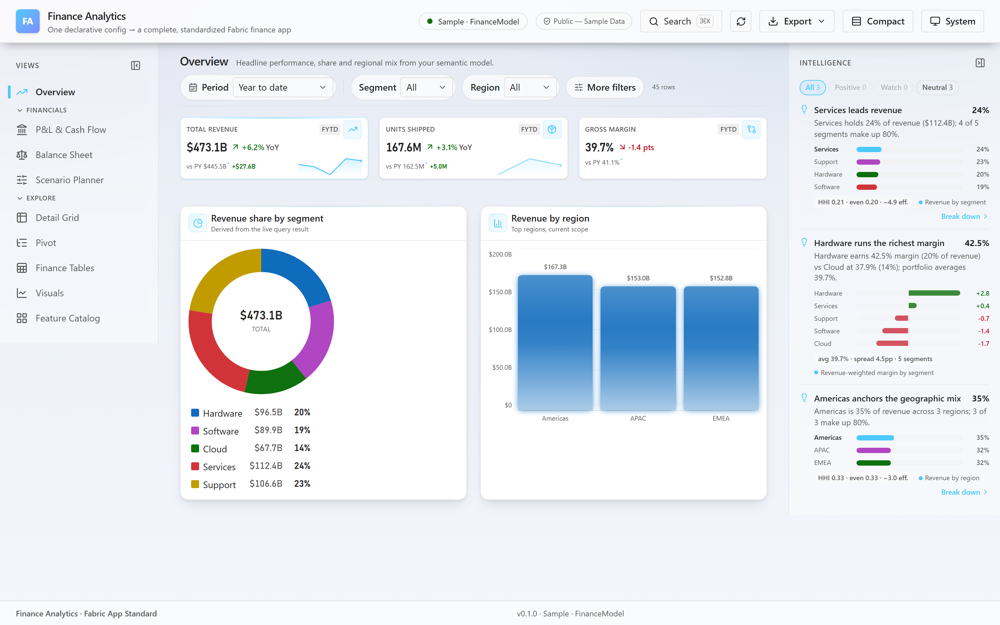
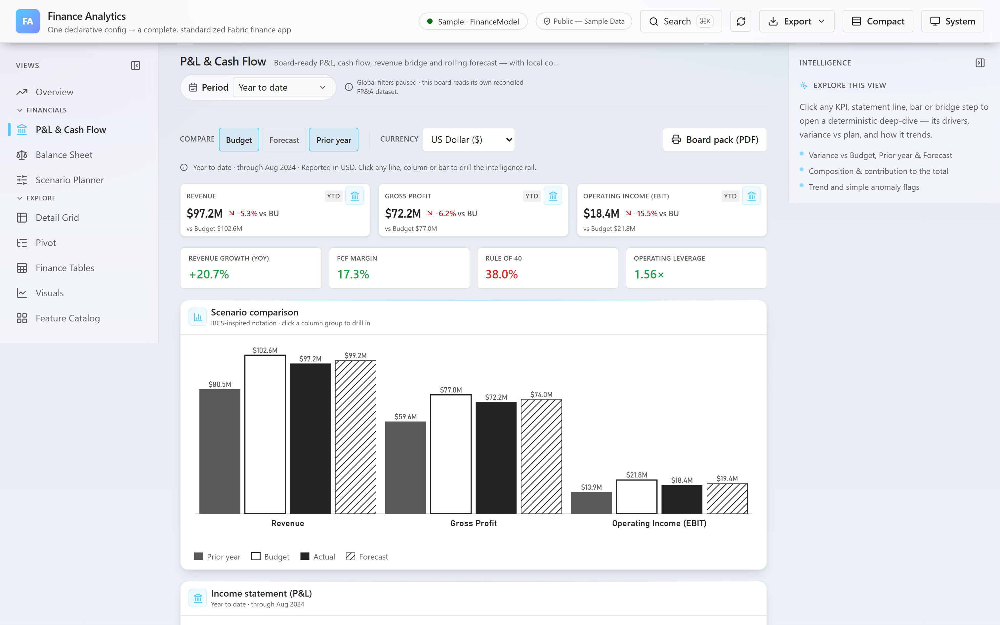
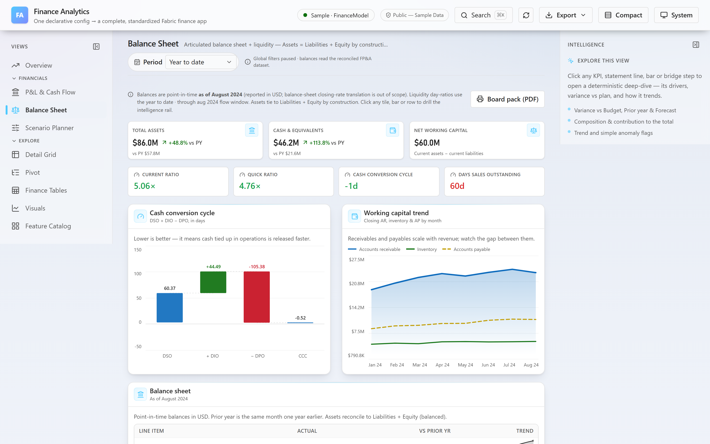
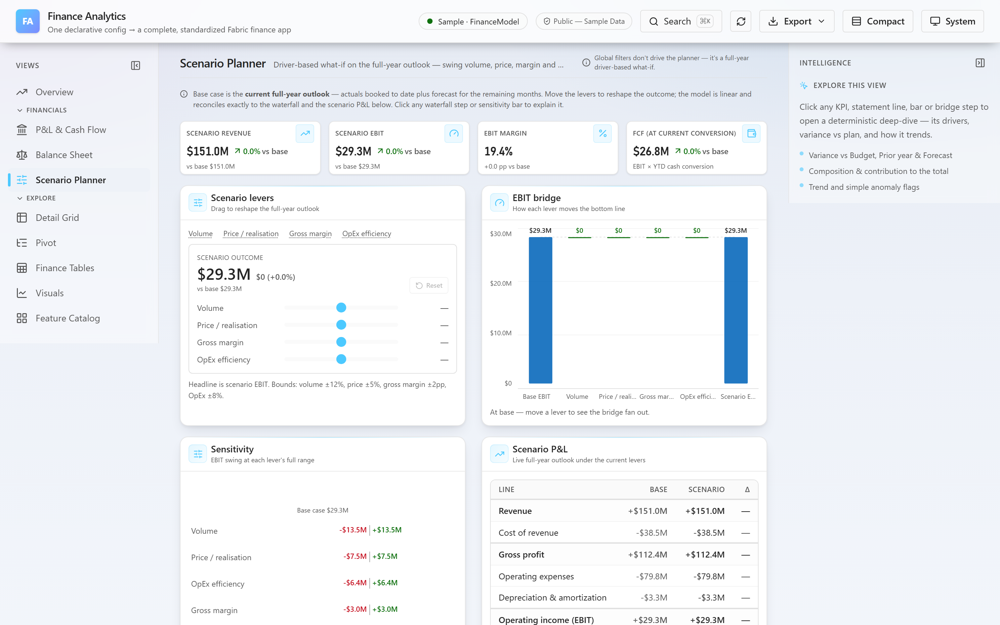
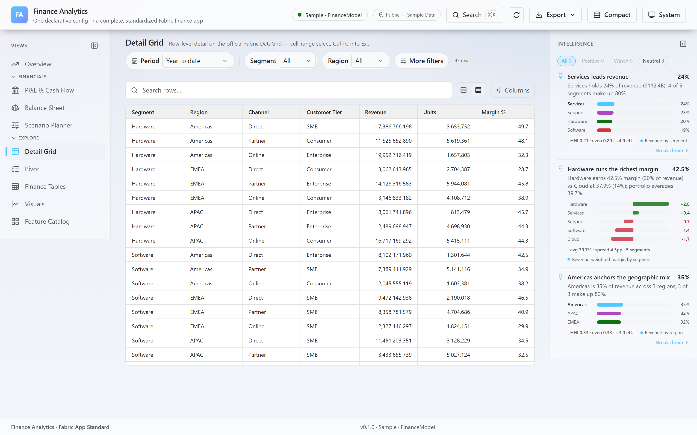

# Finance Analytics — Rayfin template

A finance-grade **Fabric data app** template. One declarative config produces a
complete, standardized FP&A application: condensed variance / trend / aging tables
with **native cell-range copy-to-Excel**, accessible charts, a config-driven shell
with filters + cross-filter, a deterministic **intelligence rail**, and one-click
**PowerPoint / Excel / CSV export**.

It runs **offline on bundled sample data** the moment you clone it — no Fabric
workspace required. Pointing it at a **live** Fabric semantic model is a small,
documented wiring step (see *Connect a real semantic model* below); the offline
demo ships wired to `staticDataSource`, not a live model.

> **Not real financials.** The bundled dataset is deterministic and illustrative.

> **Reviewing this?** [`DESIGN.md`](./DESIGN.md) records the decisions, tradeoffs, and
> honest known-limitations behind the template.

## Getting started

```bash
npm install
npm run dev          # → http://localhost:5173  (offline, sample data)
```

That's it — the full app (nav, command palette, filters, charts, tables, exports,
intelligence rail) renders against the bundled sample dataset with no auth.

Try:

- **⌘K / Ctrl-K** — command palette (fuzzy search, recents, shortcuts).
- **Detail Grid** — select a cell range and **Ctrl+C**, then paste into Excel.
- **Finance Tables** — copy any table into Excel, or export from its toolbar.
- **Export** (header) — build a branded **PowerPoint** deck, or export Excel/CSV.
- **?rows=5000** — stress the grid/pivot virtualization with N synthetic rows.

## Screenshots

| Overview — KPIs, charts & the deterministic intelligence rail | P&L & Cash Flow — IBCS scenario notation, variance vs Budget / Forecast / PY |
| --- | --- |
|  |  |
| **Balance Sheet & Liquidity** — articulated statement + cash-conversion-cycle bridge | **What-if Scenario Planner** — driver levers, live EBIT bridge & sensitivity |
|  |  |

**Detail Grid** — row-level detail on the official Fabric DataGrid; select a cell range and **Ctrl+C** straight into Excel.



## What's in the box

| Capability | Notes |
| --- | --- |
| **Export — Excel / CSV / PowerPoint** | Real `.xlsx` (numbers stay numeric), CSV, and a branded multi-slide **deck builder**. The headline differentiator. |
| **Copy to Excel** | Native cell-range `Ctrl+C` on the Fabric DataGrid + a "Copy to Excel" button on every finance table (rich TSV/HTML). |
| **FP&A tables** | Variance (Actual vs PY/Budget/Forecast), trend-over-time, aging, contribution, KPI scorecard — condensed, one-line variance cells. |
| **Charts** | Bar / line / donut / combo / waterfall / bullet / tornado / sankey / heatmap — accessible SVG with sr-only data tables and keyboard traversal. |
| **Config-driven shell** | Responsive header + drawer nav, an **independently-scrolling** sticky nav + intelligence rail (each owns its scrollbar under a shared header offset), theming, and a **compact-by-default** density scale tuned for on-screen finance work. |
| **Filters + cross-filter** | First-class filter bar (URL-persisted), click a chart segment to cross-filter the whole page. |
| **Intelligence rail** | Deterministic, source-cited insights derived from the query result — no LLM required (pluggable if you want one). Rendered as flat, dense, hairline-separated rows (tone + title + metric on one line, inline confidence + source + action), not floating cards. |
| **Explain-this-number drawer** | Clicking any number opens a scorecard (status chip + trend + an attainment/rank dial *only when like-for-like*), a computed summary, and inline SVG mini-visuals (Actual-vs-plan bars, a gap-preserving trend sparkline, a median ± 3.5·MAD outlier gauge, composition). Honesty is enforced in the kernel: aggregates are never ranked against their own finer series (`pointInSeries` gate), a `directionality` flag keeps neutral balances from reading "favorable / ahead", and the dial shows the true %. A "‹ i of N ›" stepper walks every statement row from one atomic, immutable selection snapshot. Lazy-loaded, off the initial-JS budget. |
| **Official Fabric engine (opt-in)** | Per-visual `engine="fabric"` / `gridEngine="fabric"` renders on the official Vega `VegaVisual` / `@microsoft/fabric-datagrid`, themed with your palette. |
| **Financial Statements workspace** | A board-ready FP&A page on a coherent multi-scenario dataset: hierarchical **P&L** (expand/collapse subtotals, Actual + variance vs Budget/Forecast/Prior-year, row sparklines), **indirect cash flow**, a **Price/Volume/Mix revenue bridge** that reconciles exactly, a **rolling forecast** with a confidence band sized from the forecast's own accuracy (WAPE), and **IBCS-inspired scenario notation** (grayscale-safe; colour reserved for variance). Local period / comparison / reporting-currency controls, plus one-click **board-pack PDF** (scoped `@media print`). |
| **Balance Sheet & Liquidity** | Completes the three-statement story with an **articulated balance sheet** derived from the same reconciled facts (Assets = Liabilities + Equity for every period, unit-tested), point-in-time as of the latest actual month. Liquidity ratios (current, quick, DSO/DIO/DPO, **cash-conversion-cycle** bridge, net working capital) run on the selected window's actual flows, with a working-capital trend — every tile, bar and row drills the intelligence rail. |
| **What-if Scenario Planner** | A linear, exactly-reconciling planner over the current full-year outlook: four levers (volume, price, gross-margin, OpEx) drive a **live EBIT bridge**, a **sensitivity tornado**, scenario KPIs and a mini scenario P&L. WhatIfPanel driver-math parity is unit-tested; the FCF figure is a labelled EBIT × cash-conversion proxy. |
| **Mobile-aware** | The intelligence rail collapses into a floating "Insights" button + bottom sheet below `lg`, auto-opening on each drill; interactive controls use ≥36 px touch targets. |

Components live as first-class source under `src/finance/` and are imported through
the `@/finance` alias — there's no external package to install. The Financial
Statements workspace lives in the linted `src/fpa/` module (`@/fpa`): a
deterministic statement fixture (`data/statementFacts.ts`), pure domain libs
(`statement-model`, `time-aggregation`, `drivers`, `cashflow`, `currency`,
`ibcs`, `balance-sheet`, `whatif-model`), and its feature components. Its
reconciliation invariants (subtotals, PVM, cash flow, balance-sheet articulation
and WhatIfPanel parity) are covered by the suites in `src/fpa/__tests__/`.

### FP&A dataset semantics

The statements dataset is intentionally explicit so results reconcile by
construction — see the header comment in `src/fpa/data/statementFacts.ts`:

- **Monthly grain**, fiscal year = calendar year, anchored at `AS_OF` (Actuals
  close there; later months are forecast-only). Period presets (YTD/QTD/FY/L12M)
  resolve against `AS_OF`, not the wall clock, so the demo never "runs out" of data.
- **Scenarios** AC / BU / FC; **Prior Year is derived** (same line, one fiscal
  year earlier), not a stored scenario.
- **Revenue reconciles to product drivers** (`units × price`), which is what lets
  the PVM bridge tie out to the P&L.
- **Cash flow** uses explicit working-capital + capex inputs (indirect method
  only), never re-derived from the P&L.
- **Currency** translates the P&L at the period-average rate (the correct flow
  convention); balance-sheet closing-rate translation is out of scope.

### Performance & live-data notes

The offline demo runs on bundled fixtures. When wiring a live semantic model,
the same patterns that keep this template fast still apply:

- The data layer (`use-data-query.ts`) already does request cancellation
  (`AbortController`), debouncing, an SWR cache and in-flight coalescing.
- `dax-composer.ts` pushes work down to the model (`SUMMARIZECOLUMNS` + `TOPN` +
  `ORDER BY` + `CALCULATETABLE`) rather than pulling raw rows — the single most
  important DAX performance lever. Aggregate in the model; return small results.
- Mind the Fabric **Execute Queries** REST limits when paging live data (per the
  Power BI docs: ~100k rows / 1,000,000 values per query, ~120 requests/min).
  Prefer model-side aggregation and period filters over wide row scans.

## Project structure

```
finance-analytics/
├── index.html              # entry + no-flash theme/density init
├── manifest.json           # template metadata (services, tokens)
├── rayfin-template.yml      # gallery metadata
├── AGENTS.md               # guidance for AI coding agents (see below)
├── DESIGN.md               # design decisions, tradeoffs & known limitations
├── .mcp.json               # optional Rayfin MCP server wiring (no secrets)
├── rayfin/
│   ├── rayfin.yml          # services: auth(fabric) on, data/storage off, staticHosting
│   └── data/schema.ts      # empty — no Rayfin-managed entities (reads a semantic model)
├── src/
│   ├── main.tsx            # React root
│   ├── main.css            # Tailwind v4 @source scan + finance theme tokens
│   ├── App.tsx             # ← the whole app, from one createFabricStandardApp(...) config
│   ├── data/sampleFinance.ts   # offline sample dataset
│   ├── finance/            # finance component library — first-class source (import via @/finance)
│   ├── fpa/                # Financial Statements workspace (linted; import via @/fpa)
│   └── __tests__/          # vitest unit tests (lib + shell)
├── tests/e2e/              # Playwright smoke + axe accessibility checks
├── vite.config.ts          # react-swc + tailwind + @ alias + chunking
├── vitest.config.ts
├── eslint.config.js
└── tsconfig.json           # references ./rayfin
```

Add a page by pushing a `PageDef` onto `pages` in `src/App.tsx`; add a chart by
returning another spec from a page's `charts(t)` function.

### Built for AI agents

`AGENTS.md` and `.mcp.json` are intentional, not scaffolding cruft. `AGENTS.md`
orients an AI coding agent (Copilot, Claude, etc.) to the one-config architecture so
"add a page / add a chart" prompts land correctly. `.mcp.json` optionally wires the
`@microsoft/rayfin-mcp` server via `npx` for agent-driven Fabric workflows. Both are
opt-in, contain no secrets or machine-specific paths, and are safe to delete if your
workflow doesn't use them.

## Scripts

| Script | Does |
| --- | --- |
| `npm run dev` | Vite dev server, offline sample data (no Fabric auth). |
| `npm run dev:fabric` | `rayfin up` + Vite — dev against Rayfin services (needs login). |
| `npm run build` | `tsc -b && vite build` — type-check + production bundle. |
| `npm run build:fabric` | Production build for Fabric static hosting (same bundle as `build`); deploy `dist/` with `rayfin up`. |
| `npm run preview` | Preview the production build. |
| `npm run typecheck` | `tsc -b` across the app + `rayfin` project reference. |
| `npm run lint` | ESLint across the whole template, `src/finance` included. |
| `npm test` | Vitest unit tests (formatters, filters, shell). |
| `npm run test:e2e` | Playwright end-to-end smoke + axe accessibility scan. |

## Connect a real semantic model

The offline demo reads bundled sample data via `staticDataSource(...)`. Wiring a
**live Fabric semantic model** is not done for you — it's a deliberate, documented
step. Swap the data source in `src/App.tsx`:

```ts
import { createFabricStandardApp, fabricDataSource } from "@/finance";

const dataSource = fabricDataSource({
  client,                 // Rayfin SDK client — the host brokers auth (no tokens/MSAL)
  connection: "financeModel",   // an alias declared in fabric.yaml
  columns,                // FabricColumnMetaMap for the query's result columns
});
```

`fabricDataSource` is a real, exported adapter (`src/finance/data/fabric-data-source.ts`),
but this template does **not** ship the surrounding live-model plumbing you'll need to
supply yourself:

- a `fabric.yaml` declaring the `connection` alias,
- an initialized Rayfin SDK `client` (from `@microsoft/rayfin-client`),
- a `columns` (`FabricColumnMetaMap`) describing your DAX result shape.

Fabric auth is **host-brokered** — the portal supplies the token at runtime, so there
are no secrets in source. The query is a standard DAX
`EVALUATE SUMMARIZECOLUMNS(...)`; the bundled DAX composer/pushdown helpers can build it
and fold active filters into a `CALCULATETABLE` so the model filters at source.

## Deploy to Fabric

The app is a self-contained Rayfin app — deploy it to a Fabric workspace with the
Rayfin CLI (no separate "blank app" to import into; this *is* the app). From the
template folder:

```bash
npm install
npx rayfin login                                 # sign in to your tenant
npx rayfin up --workspace-id <your-workspace-id> # provision + build + upload
```

`rayfin up` reads `rayfin/rayfin.yml`, runs its `buildCommand` (`npm run build:fabric`
→ `dist/`), provisions the **Fabric auth** and **static-hosting** services, and uploads
the built frontend. On success it prints the live hosting URL (e.g.
`https://<name>.webapp.<region>.fabricapps.net`) and adds it to the app's allowed
redirect URIs automatically. Re-run `npx rayfin up` from the folder to redeploy.

Your workspace id is the GUID in the Fabric portal URL:
`https://app.powerbi.com/groups/`**`<workspace-id>`**`/list`.

Notes:

- **Auth is host-brokered**, so the deployed app expects to run **inside Fabric** —
  opening the raw hosting URL directly will prompt for sign-in.
- It deploys wired to the **bundled sample data**. To show live data, follow
  *Connect a real semantic model* above before deploying.
- `npm run dev:fabric` runs the app locally against provisioned Rayfin services
  (needs `rayfin login`); plain `npm run dev` stays fully offline.

## Components & dependencies

The finance component library lives as **first-class source** under `src/finance/`
(imported via the `@/finance` alias) — original work authored for this template, with
no external package to install. It's linted and tested with the rest of the app; see
[NOTICE](./NOTICE) for third-party dependency attributions.

The official Fabric engine is **opt-in**: pages that set `engine="fabric"` /
`gridEngine="fabric"` render on `@microsoft/fabric-datagrid` and the Vega
`VegaVisual` — the demo's Detail Grid does this, so those `@microsoft/fabric-*`
packages are listed as dependencies and install by default. Every visual and grid
also ships a built-in, dependency-free engine, so switching those pages back to the
default `custom` engine lets you remove the `@microsoft/fabric-*` packages entirely
and the app still runs.

## Tech stack

React 19 · TypeScript 5 (ES2022) · Vite 7 · Tailwind CSS v4 · Vitest · ESLint 9 ·
Rayfin (Fabric auth + static hosting) · optional `@microsoft/fabric-datagrid` /
`@microsoft/fabric-visuals`.

## License

MIT — see [LICENSE](./LICENSE).
