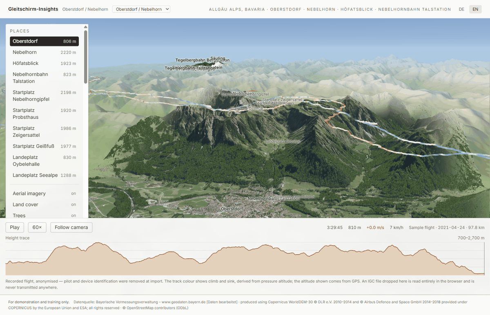
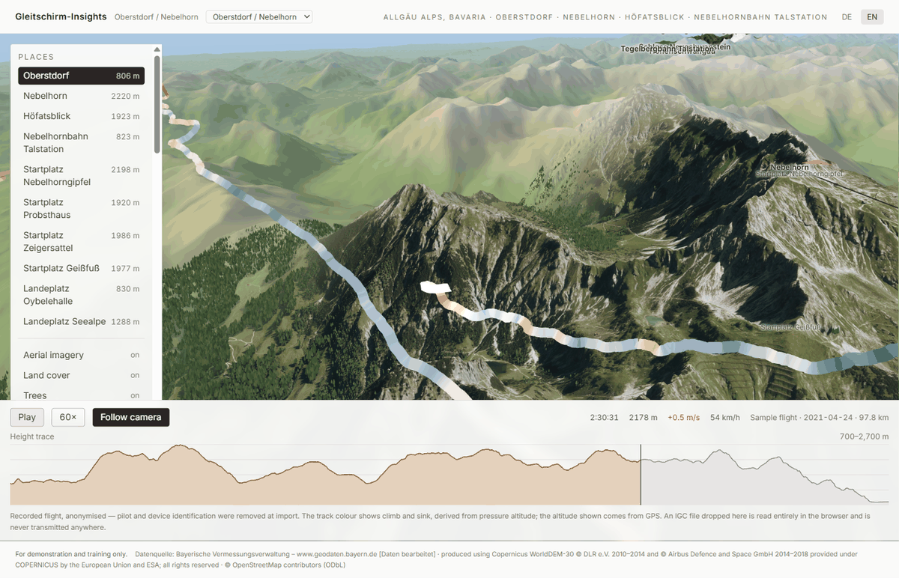
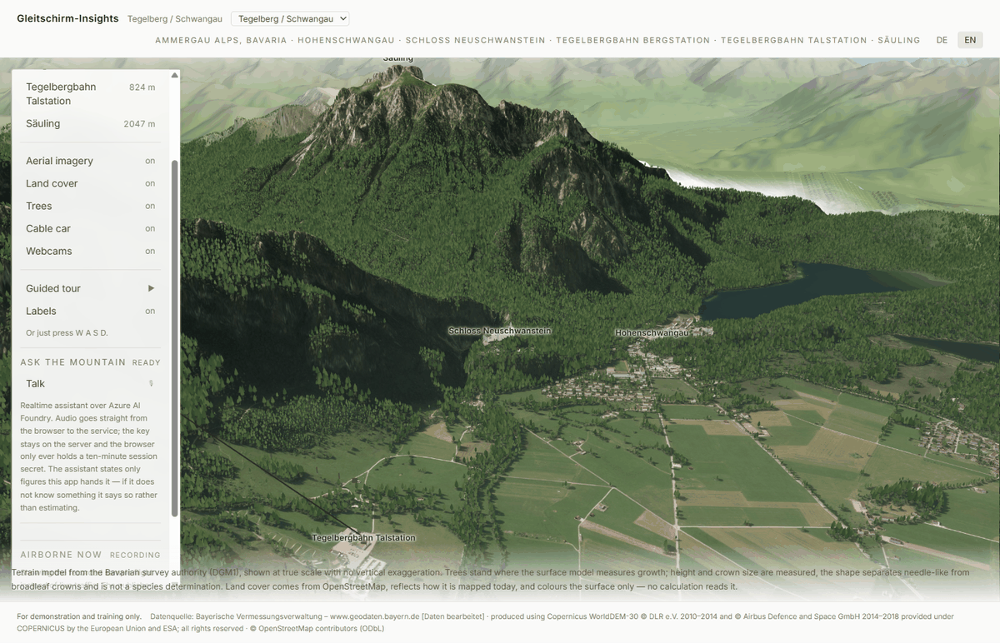
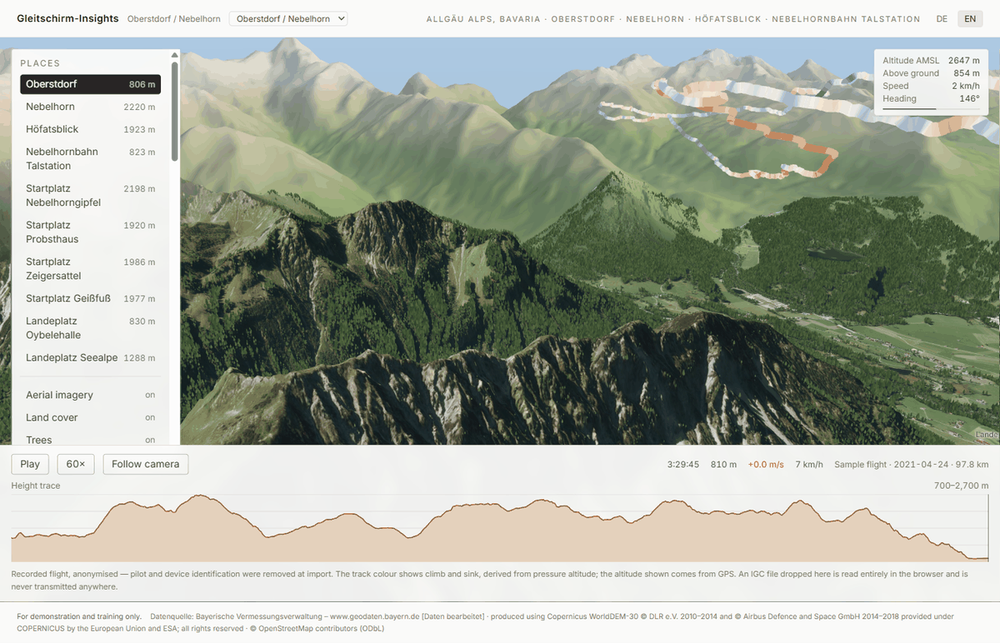
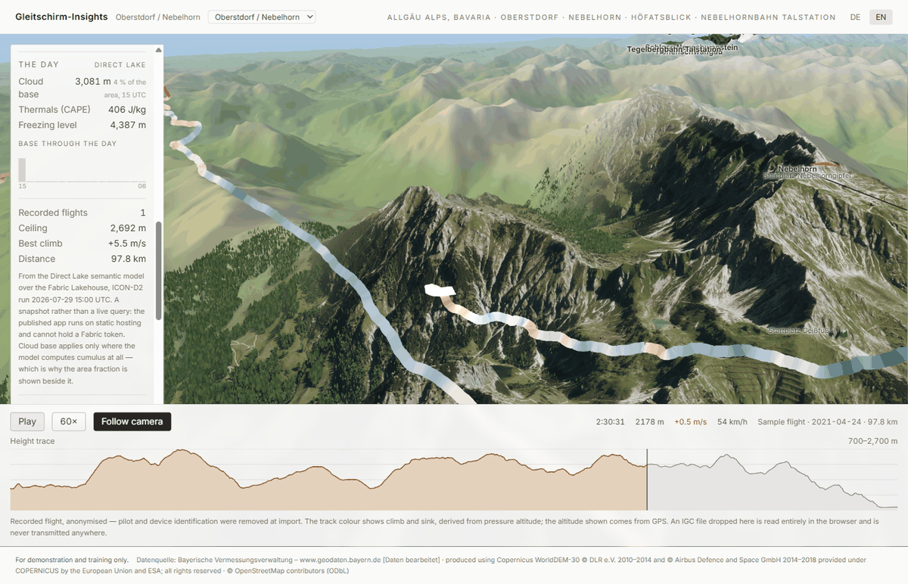

# Paragliding Insights

**Der Luftraum über Oberstdorf und dem Nebelhorn als interaktive 3D-Flugkarte.**
*The airspace over Oberstdorf and the Nebelhorn as an interactive 3D flying map.*

> Demonstrations- und Schulungszweck. Keine Flugvorbereitung, keine Wetterberatung, keine
> verbindliche Luftraumauskunft.
> *Demonstration and training only. Not flight preparation, not a weather briefing, and not an
> authoritative source of airspace information.*

> The app calls itself **Gleitschirm-Insights** on screen and in its own sources — that is its name,
> and renaming the product inside a template would only make its own tests and comments lie. The
> gallery entry is `paragliding-insights`, which is the same name in English.

---



*Looking east over Oberstdorf (806 m) towards the Nebelhorn (2 224 m). Terrain from the Bavarian
survey at 1 m, buildings from LoD2, trees measured from the surface model, the horizon from
Copernicus — and the recorded flight drawn across it, orange where the pilot climbed and blue where
they sank.*

## What this is

A **Microsoft Fabric App** that renders 9 × 8 km of the Allgäu Alps at true scale from official 1 m
terrain data, surrounds it with 30 km of coarse terrain so the horizon is a mountain range rather
than a cliff edge, and replays real paraglider flights over it.

The subject is paragliding. **The point is Fabric** — Real-Time Intelligence, Direct Lake,
Notebooks and Pipelines, and above all the Fabric App itself as the delivery vehicle. The Allgäu is
what makes people lean forward; Fabric is what they take home.

Five things you can do with it:

1. **Look at the mountain.** Oberstdorf at 813 m, the Nebelhorn at 2 224 m, 1 400 m of relief
   between them, at true scale with no vertical exaggeration.
2. **Replay a flight.** The track draws itself coloured by climb and sink, the barogram doubles as
   the scrubber, and the wind is derived from the flight's own thermal circles.
3. **Fly it yourself.** Press `W` and the orbit camera becomes a drone — `R` and `F` circle whatever
   is in the middle of the view. See [Drone mode](#drone-mode).
4. **Watch who is flying right now.** *(Phase 4.)* Live FANET/FLARM traffic when the sky cooperates.
5. **Ask it questions.** *(Phase 6.)* Voice and chat over the same data.

…and then **switch the whole thing to a different mountain** from the dropdown in the header.

## Replaying a flight



The track draws itself coloured by climb and sink, the barogram doubles as the scrubber, and the
readout above it is the vario and ground speed at the instant under the head. The camera can follow
the glider without taking the controls away — following moves the orbit centre, so you can still
turn around the wing while it flies.

The bundled flight is a real one, anonymised at import: `tools/flights/anonymise_igc.py` strips the
pilot, glider and logger-serial records before the file ever reaches `public/flights/`. Drop your own
IGC on the window and it is parsed **entirely in the browser** — nothing is uploaded.

## Two sites, one build



The location is configuration. Two areas of interest ship:

| | Oberstdorf / Nebelhorn | Tegelberg / Schwangau |
|---|---|---|
| URL | `/` | `/?aoi=tegelberg` |
| Core | 9.6 × 8.5 km | 7.7 × 7.4 km |
| Relief | 813–2224 m | 773–2047 m |
| Registration residual | −0.44 m median, 79 peaks | −0.94 m median, 33 peaks |
| Buildings / trees | LoD2 + canopy | 3736 / 229 007 |
| Bundled flight | yes | **none — and it shows none** |

Adding the second one cost one JSON file and no new data-source code: same LDBV tiles, same
Copernicus shell tile, same Overpass queries, same renderer. What it *did* cost was five places
where the app had quietly hard-coded the first site — the guided tour, the bundled flight, a layer
label, the tab title and the canvas description for screen readers — none of which looked wrong on
screen. `e2e/aoi.spec.ts` now pins all five. See PLAN §4.4.

The Tegelberg deliberately ships **no** flight: the archive contains none over it, and borrowing
Oberstdorf's would mean drawing a precise, plausible, entirely fictional track through the wrong
valley.

Everything is built from openly licensed data, registered in **[NOTICE.md](NOTICE.md)** before use.
The framing and content rules are binding and live in **[PLAN.md](PLAN.md) §2 — they outrank every
other part of this repo.**

## Getting started

Scaffold it from the gallery:

```bash
npm create @microsoft/rayfin -- --template https://github.com/microsoft/awesome-rayfin
# choose "Paragliding Insights"
```

You need Node 20+, Python 3.11+, and about 380 MB of download budget for the geodata.

```bash
npm install
pip install -r tools/requirements.txt

python tools/geodata/pipeline.py   # downloads and derives terrain, land cover, buildings, cableway
npm run dev                        # http://localhost:5173
```

A fresh clone has **no terrain** until the pipeline has run — the derived assets are tens of
megabytes and are reproducible from open sources at any time, so they are not committed. That is a
normal first-run state and the app says so rather than failing with a fetch error.

The pipeline is resumable and safe to re-run; downloads are cached and verified. It compiles every
step and checks its imports **before** anything is downloaded, so a broken step fails in two seconds
rather than after 568 MB. Individual steps, and the second site:

```bash
python tools/geodata/pipeline.py --list
python tools/geodata/pipeline.py --only verify
python tools/geodata/pipeline.py --aoi tegelberg   # build the other site
```

Every generated asset is written per AOI (`public/terrain/<aoi>/`, `data/raw/osm/<aoi>/`), so the
two sites cannot overwrite each other's data.

### Live traffic and the assistant (optional)

```bash
npm run relay        # node server/ogn/relay.js — live OGN traffic, port 8787
npm run voice        # node server/voice/mint.js — realtime voice secrets, port 8788
```

Two separate processes on purpose: they share nothing and must fail independently — a missing device
database should not cost you the assistant, and vice versa. **Neither is required.** Without the
relay, live traffic reports itself unavailable and the recorded flight is shown instead, badged
*Aufzeichnung*; without the voice service the assistant says so. That is also what the deployed
build does, because static hosting can hold neither a TCP socket nor a credential.

The voice service mints a **ten-minute ephemeral secret** from an Azure CLI token and hands only
that to the browser, which then talks to Azure AI Foundry directly. No API key exists in this repo,
and none reaches the client.

## Drone mode



Press `W` and the map camera becomes a drone. There is no button for it, and that is the point.

| Input | Not flying | Flying |
|---|---|---|
| `W A S D` | — | forward / left / back / right |
| `Q` `E` | — | down / up |
| `R` `F` | — | circle whatever is in the middle of the view |
| left drag | orbit the map | look around from where you are |
| arrow keys | — | look around |
| mouse wheel | zoom towards the target | throttle |
| `Shift` + drag | pan the map | a short sprint |
| `Esc` | — | hand the camera straight back to the map |

The eight movement keys are **six** behaviours, not four. `R` and `F` used to be a second pair of
up/down keys — literally `held.has('e') || held.has('r')` — which is a key doing nothing, because
nobody presses two keys for one thing. They now swing the camera around whatever is centred, which
is the one move a drone cannot otherwise make: `W A S D` plus drag can approach a thing and can look
at it, but keeping it centred while going round it needs both at once, in opposite directions, at a
rate that depends on the distance. The spin is **angular** rather than linear (`SPIN_PER_SECOND`,
~10 s per lap), so the same key is a slow crawl around one building and a wide sweep around a
valley without anybody setting anything.

The centre is **latched** while either key is held, and that is the only subtle part: re-deriving it
from the view ray every frame sounds simpler and is wrong — the ray lands further away as the
terrain falls off and nearer as it rises, so the circle walks across the map and the thing you were
looking at slides out of frame. Sampling once and holding it is what makes it an orbit rather than a
drift.

The two camera models bind the same four inputs — drag, wheel, `Shift`+drag and the arrow keys — so
they cannot both be live. `src/twin3d/flyControls.ts` resolves that with a **latch rather than a
toggle**: pressing any fly key engages the drone, and one second after the last key comes up the
camera is handed back to the map, in place and inside the orbit limits it did not set. The grace
window is deliberate: disengaging on key-up would change what the wheel means while you were still
flying.

The camera slows down automatically near the ground, and the HUD (`drone-hud`) shows altitude AMSL,
height above ground, speed and heading — read off the same heightmap the terrain is displaced by.
**There is no collision and no wing physics.** It is a camera, not a flight simulator, and saying so
is cheaper than a simulation the app cannot honestly claim.

`flyControls.ts` imports nothing but `three`, talks to the orbit camera through a structural
interface, and takes every number as an option — so it ports to another 3D template by copying one
file. `src/twin3d/__tests__/flyControls.test.ts` and `e2e/drone.spec.ts` pin the behaviour.

## How it is put together

The terrain is **two tiers**, and the reason is a flight rather than a rendering preference. The one
flight in the archive that reaches Oberstdorf spans roughly 20 × 17 km, and a track that runs off
the edge of the map looks broken. So a photoreal 9 × 8 km **core** (LDBV DGM1, LoD2 buildings, land
cover, the Nebelhornbahn) sits inside a ~30 × 34 km **shell** of coarse Copernicus terrain that
continues into Austria, where the Bavarian data stops. The shell is also the horizon: without it the
most dramatic terrain in Germany reads as a model on a table.

Everything is **derived offline and read in the browser**. `tools/geodata/` turns open geodata into
the assets under `public/terrain/`; the renderer displaces a plane by a quantised height grid and
colours it. If a number looks wrong, the bug is almost always in the pipeline, not the renderer.

**No coordinate is ever recalled.** Every place in `config/aoi/*.json` is resolved from
OpenStreetMap by `tools/geodata/resolve_places.py`. This is not a stylistic rule — the AOI shipped
for a while with an `Oberstdorf` 4.6 km from the town, and the thing that caught it was the terrain:
the heightmap put that point at 1115 m against a published 813 m.

## The registration gate

`tools/geodata/verify_registration.py` runs as part of the pipeline and **fails the run** if the
terrain is not where it claims to be. It compares the generated model against every published summit
elevation inside the AOI — 79 peaks, currently a median residual of −0.44 m with a spread of 3.79 m
and no correlation with easting or northing — and draws a longitudinal profile from Oberstdorf to
the summit.

It is a gate rather than a report because a flight track drawn over a misregistered mountain is
worse than no map at all: it looks authoritative.

## Project structure

```
config/aoi/         area of interest — the only place a coordinate or a place name lives
tools/geodata/      the pipeline: fetch, build, verify
tools/flights/      IGC anonymisation, and curation into the Lakehouse tables
tools/ogn/          the OGN reachability spike — the gate phase 4 had to pass
tools/weather/      ICON-D2 sizing spike and the AOI harvest
tools/fabric/       Lakehouse, Eventhouse, semantic model, verification, Mode D export
server/ogn/         the live relay: APRS-IS client, privacy filter, SSE fan-out
server/voice/       ephemeral-secret minting for the voice assistant
fabric/kql/         Real-Time Intelligence schema
fabric/notebooks/   the scheduled ICON-D2 harvest
rayfin/             Rayfin service configuration — Fabric auth and static hosting, no data entities
src/twin3d/         the renderer — terrain, shell, buildings, cableway, track, live traffic, sky, camera
src/flight/         IGC parsing, vario, and the wind derivation
src/live/           the relay client
src/voice/          the assistant and the tools it may call
src/components/     React shell, barogram, wind profile, live panel, day panel
e2e/                Playwright guardrails — loading, AOI, drone, deployment
public/terrain/     generated, gitignored, reproducible
public/flights/     anonymised sample flights — committed on purpose
public/day/         Mode D snapshot, exported from the semantic model
```

## Scripts

| Script | What it does |
|---|---|
| `npm run dev` | Vite dev server on <http://localhost:5173> |
| `npm run dev:fabric` | Provisions Rayfin services (except static hosting), then starts Vite |
| `npm run build` | `tsc -b && vite build` — the production bundle |
| `npm run build:fabric` | The build Rayfin runs when it deploys static hosting |
| `npm run preview` | Serves the built bundle |
| `npm run lint` | ESLint over the whole repo |
| `npm test` | Vitest — IGC parsing, wind derivation, camera, relay privacy filter |
| `npm run test:e2e` | Playwright — loading, AOI switching, drone mode, deployment guardrails |
| `npm run relay` | The OGN relay on port 8787 (optional) |
| `npm run voice` | The voice-secret service on port 8788 (optional) |
| `npm run curate` | IGC → `flight_fix` / `flight_summary` / `flight_wind` for the Lakehouse |
| `npm run data:build` | `python tools/geodata/pipeline.py` — downloads and derives the terrain |

## Fabric



*Everything in that panel is queried from a Direct Lake semantic model over the Fabric Lakehouse and
exported as one snapshot the static app can read. The wind below it is not a forecast: it is measured
from the drift of 109 complete 360° turns the pilot flew, and the altitude bands where nobody circled
stay empty.*

The analytical half runs in Microsoft Fabric, and the pieces are provisioned by script rather than
by clicking:

```bash
npm run curate                                  # IGC -> flight_fix / flight_summary / flight_wind
python tools/weather/harvest_icond2.py          # ICON-D2 -> weather (AOI aggregate)
python tools/fabric/setup_lakehouse.py          # Lakehouse + upload
python tools/fabric/load_tables.py              # CSV -> Delta
python tools/fabric/create_semantic_model.py    # Direct Lake model
python tools/fabric/verify_model.py             # query it and compare against the source
python tools/fabric/export_day.py               # DAX -> public/day/<aoi>.json for Mode D
```

⚠️ `verify_model.py` is not optional politeness. A Direct Lake partition pointing at a path that
does not exist frames **zero rows and reports no error** — every visual is simply empty. The only
honest check is to ask the model questions and compare its answers with the files it was built
from.

## Privacy

Live tracking shows real people, so the rules are enforced in the relay rather than in the browser:
a pilot who has opted out of the [OGN device database](https://ddb.glidernet.org/) is never sent to
the client at all, and everyone else arrives without a registration. Aircraft that are not
identifiable are given a **salted hash** rather than their hardware address — the database is
public, so forwarding the real device id alongside a blank registration would let any client look
the pilot up and undo the flag. The salt is regenerated on every relay start.

Of the 36 126 devices registered when this was written, 350 had opted out of tracking and 472 out of
identification. It is not a hypothetical rule.

## Before you commit

```bash
npx tsc -b        # types
npm run lint
npm test          # unit — IGC parsing, wind derivation, the fact register
npm run test:e2e  # loading and deployment guardrails
```

## Licence

Source code is MIT — see [LICENSE](LICENSE). **The data is not ours to relicense**: terrain,
buildings, land cover and imagery are third-party open data with their own attribution
requirements, all listed in [NOTICE.md](NOTICE.md). The attribution block must travel with any
redistribution or public deployment.
